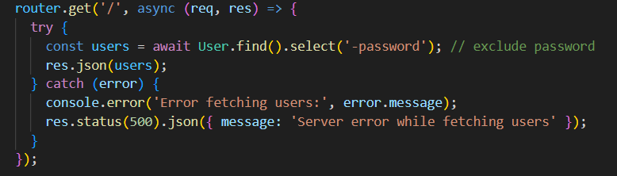
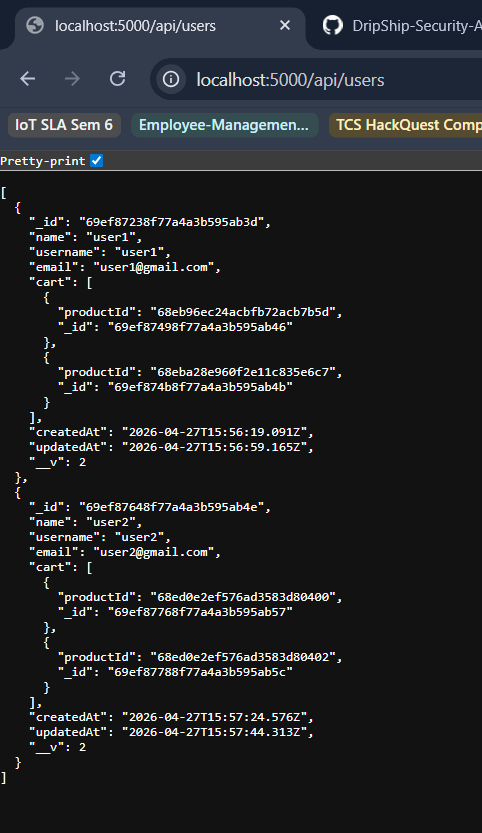
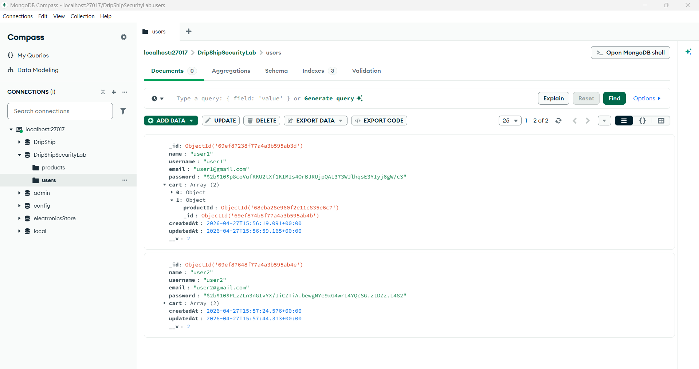

# Finding 01 — Broken Access Control

## Severity
High

## Category
OWASP Broken Access Control

## Endpoint
GET /api/users

## Description
The endpoint exposes all registered users without authentication.

No JWT is required.

## Proof of Concept

Request:

GET http://localhost:5000/api/users

Result:
User names, usernames, emails, cart data, and IDs are disclosed.

## Impact
An attacker can:

- Enumerate users
- Harvest user IDs
- Support later IDOR attacks
- Leak sensitive metadata

## Root Cause

Route lacks authentication middleware:

```javascript
router.get('/', async (req,res)=>{
```

Should require:

```javascript
verifyToken
```

## Evidence

### 1. Route lacks authentication middleware


---

### 2. Unauthenticated user enumeration


---

### 3. Sensitive data disclosure impact


## Remediation (To Be Implemented)
Require authentication and role checks.