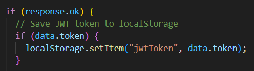
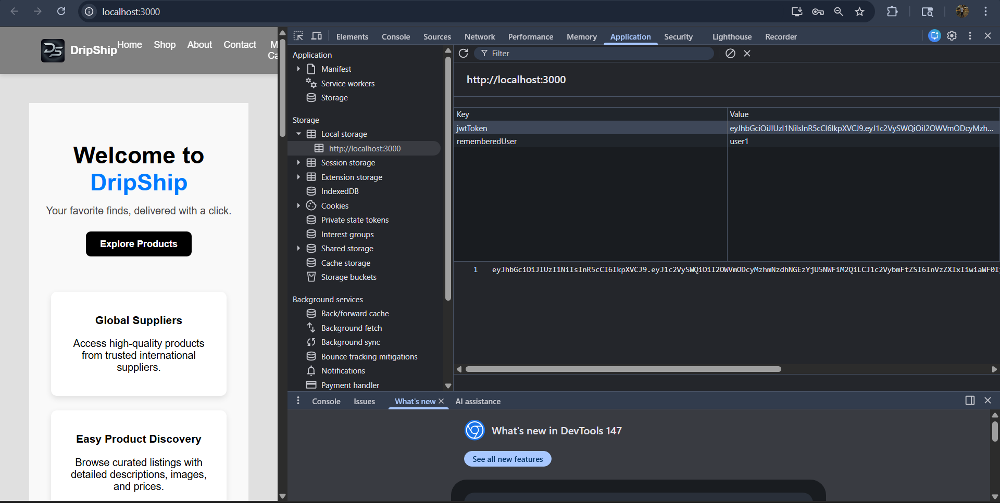
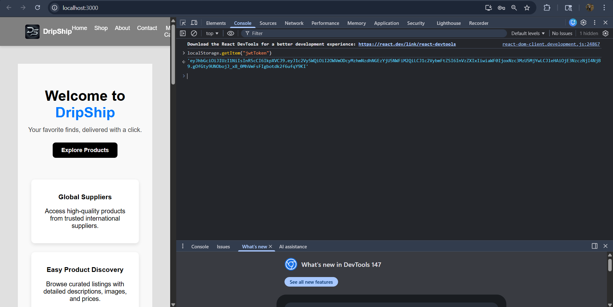

# Finding 02 — Insecure JWT Storage (Token Theft Risk)

## Severity
Medium

Reason:
Escalates to High when combined with XSS.

## Category
OWASP A07 Identification and Authentication Failures
Session Management Weakness

## Description
JWT session tokens are stored in browser localStorage.

Tokens stored in localStorage are accessible to JavaScript and can be stolen through XSS attacks.

## Proof of Concept

After login:

Token observed in browser storage:

jwtToken = eyJ...

JavaScript can access it:

```javascript
localStorage.getItem("jwtToken")
```

## Impact

An attacker exploiting XSS could:

- Steal active JWT sessions
- Hijack user accounts
- Replay authenticated requests
- Maintain persistence until token expiration

## Root Cause

Token stored client-side using:

```javascript
localStorage.setItem("jwtToken", data.token)
```

More secure alternatives:

- HttpOnly cookies
- Secure SameSite session cookies

## Evidence

### 1. JWT stored in application code


---

### 2. JWT visible in browser storage


---

### 3. Token readable by JavaScript


## Remediation (To Be Implemented)

Avoid storing JWTs in localStorage.

Use:
- HttpOnly cookies
- Secure + SameSite flags
- Short-lived access tokens with refresh rotation