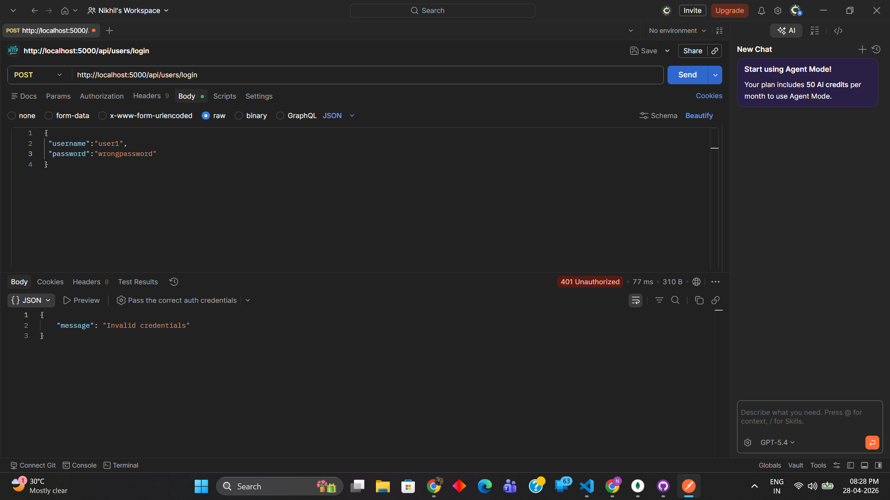
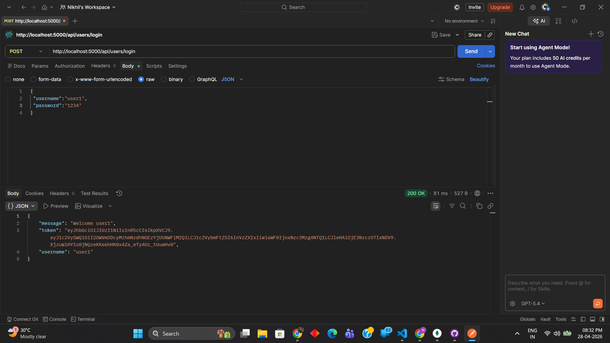
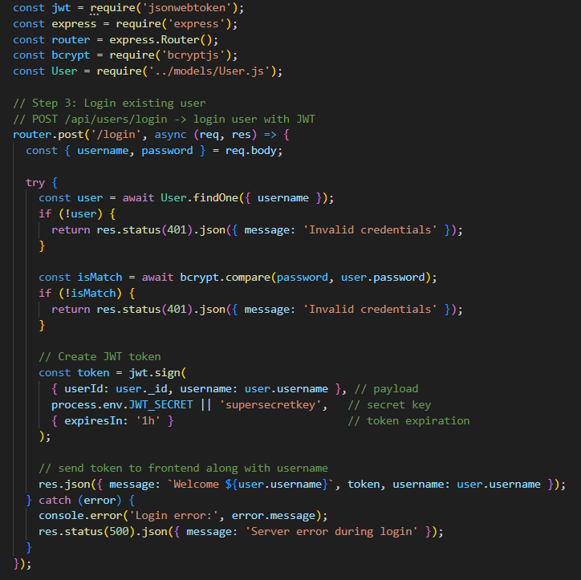

# Finding 03 — Authentication Endpoint Lacks Brute Force Protections

## Severity
Medium

## Category
OWASP Identification and Authentication Failures

## Endpoint
POST /api/users/login

## Description
The login endpoint lacks server-side protections against repeated authentication attempts.

Client-side lockout exists only in frontend logic and can be bypassed by directly calling the API.

## Proof of Concept

Repeated invalid login requests sent through Postman:

POST /api/users/login

Response:
401 Invalid credentials returned indefinitely.

After multiple failed attempts, valid credentials still successfully authenticate.

## Impact

An attacker may:

- Perform brute-force attacks
- Conduct password spraying
- Attempt credential stuffing and password spraying
- Bypass frontend-only lockout controls

## Root Cause

Login route lacks:

- Rate limiting
- Server-side lockout
- Progressive delays
- Captcha or abuse controls

## Evidence

### 1. Unlimited failed login attempts accepted

---

### 2. Valid authentication still succeeds after repeated failures

---

### 3. Login endpoint lacks server-side brute-force protections

## Remediation (To Be Implemented)

Use:
- express-rate-limit
- Account lockout thresholds
- Progressive backoff delays
- CAPTCHA after repeated failures