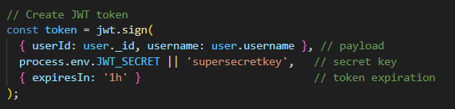
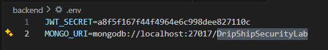
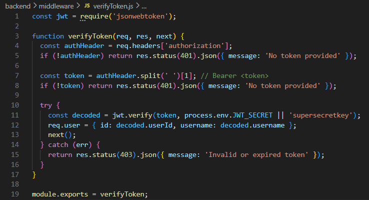

# Finding 04 — Weak JWT Secret & Token Trust

## Severity
High

## Category
OWASP Identification and Authentication Failures

## Endpoint
All authenticated routes using JWT

---

## Description

The application uses a JWT-based authentication mechanism with a fallback hardcoded secret and lacks strict validation controls.

If the environment variable `JWT_SECRET` is missing or exposed, the application falls back to a predictable secret (`supersecretkey`). This allows attackers to forge valid authentication tokens.

Additionally, the server fully trusts the decoded token payload without enforcing additional validation checks.

---

## Proof of Concept

JWT token is created using:

```javascript
process.env.JWT_SECRET || 'supersecretkey'
```

## Impact

An attacker can:

- Forge authentication tokens
- Impersonate any user
- Bypass authentication entirely
- Access protected endpoints
- Perform actions on behalf of other users

## Root Cause

- Hardcoded fallback secret in application code
- No enforcement of mandatory environment configuration
- Blind trust in JWT payload after verification
- No additional validation checks (issuer, audience, token version)
- No token revocation or rotation mechanism

## Evidence

### 1. JWT signing uses fallback secret


---

### 2. JWT secret stored in environment configuration


---

### 3. Token payload trusted without validation


## Remediation (To Be Implemented)
- Remove hardcoded fallback secret
- Enforce presence of JWT_SECRET at startup
- Use strong, unpredictable secrets
- Implement token validation claims (iss, aud)
- Introduce short-lived access tokens with refresh tokens
- Add token revocation or blacklisting mechanisms